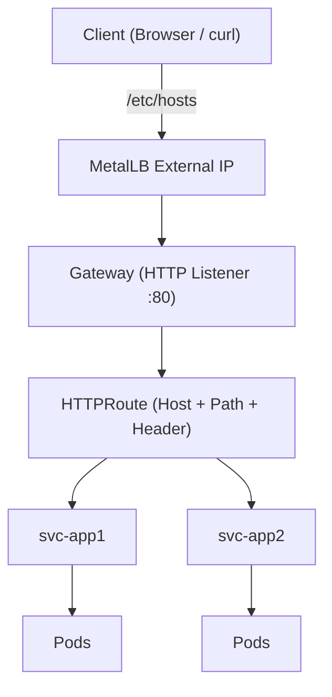
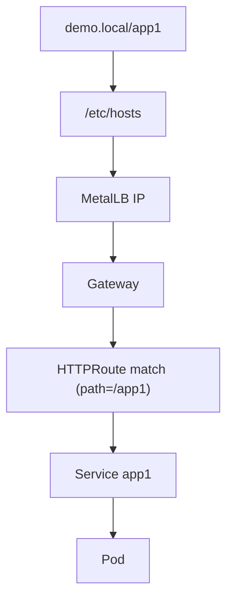

## 🚀 Kubernetes Gateway API Demo (Local Lab with MetalLB)
## Table of Contents

- [Overview](#overview)
- [Why Gateway API? (History & Motivation)](#why-gateway-api?-(history-&-motivation))
- [Architecture Diagram](#architecture-diagram)
- [Traffic Flow](#traffic-flow)
- [Prerequisites](#prerequisites)
- [Step 4: View the pods and services](#step-4-view-the-pods-and-services)
- [Step 5: Access the web app](#step-5-access-the-web-app)
- [Conclusion](#conclusion)
- [Extra: YAML files](#extra-yaml-files)

## 🧭 Overview
This guide demonstrates how to **deploy and test Kubernetes Gateway API** in a **local VMware Fusion Pro lab** using:
+ 🖥️ VM-based Kubernetes cluster
+ 🌐 MetalLB (for LoadBalancer IPs)
+ 🧾 `/etc/hosts` (for local DNS resolution without public IP)

Note:
+ _We opted for host file because for lab we normally do not have a public IP addres lying around, nor does we have a public DNS pointing to it._
+ _We can also use other virtualization tools other than VMware Fusion, eg Hyper-V, etc)_

It includes:
+ ✅ Path-based routing (`/app1`, `/app2`)
+ ✅ Hostname-based routing
+ ✅ Conditional header-based routing
+ ✅ Architecture diagrams
+ ✅ Gateway API vs Ingress comparison

## 📜 Why Gateway API? (History & Motivation)

The traditional **Ingress API** has been widely used but has limitations:

+ ⚠️ Controller-specific annotations (not portable)
+ ⚠️ Limited extensibility
+ ⚠️ Weak separation of concerns

✨ **Gateway API improves this by**:

+ 👥 Role-oriented design (infra vs app teams)
+ 🔌 Extensible routing model
+ 🎯 Rich traffic matching (path, host, headers)

👉 Gateway API is the **next evolution of Ingress**.

## 🏗️ Architecture Diagram



## 🔀 Traffic Flow



## ⚙️ Prerequisites

+ Kubernetes cluster (v1.26+)
+ kubectl configured
+ VMware Fusion Pro VMs
+ Same subnet networking

## 📦 Step 1: Install Gateway API

```
kubectl apply -f https://github.com/kubernetes-sigs/gateway-api/releases/download/v1.0.0/standard-install.yaml
```


## 📦 Step 2: Install MetalLB

```
kubectl apply -f https://raw.githubusercontent.com/metallb/metallb/v0.14.5/config/manifests/metallb-native.yaml
```


Note: If you have installed MetalLB before, the configured resources will simply remained "unchanged".

## 🌐 Step 3: Configure IP Pool

The IP range under _.spec.addresses_ must be reachable from the host. Normally this is the same IP address range used by the nodes. </br>
Use `kubectl get nodes -o wide` to confirm it. <br>
Use `ip address` to confirm the CIDR mask. </br>
Pick a range inside that subnet which won't be used by nodes. For example if the CIDR is /24, pick range at the end, between .240 to .250.

```
apiVersion: metallb.io/v1beta1
kind: IPAddressPool
metadata:
  name: pool
  namespace: metallb-system
spec:
  addresses:
  - 172.16.121.240-172.16.121.250
---
apiVersion: metallb.io/v1beta1
kind: L2Advertisement
metadata:
  name: l2
  namespace: metallb-system
```


