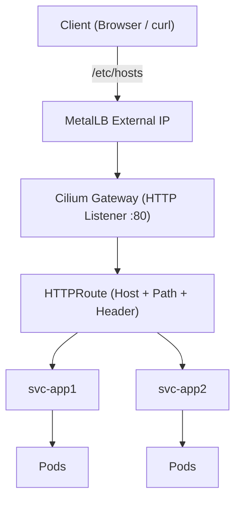
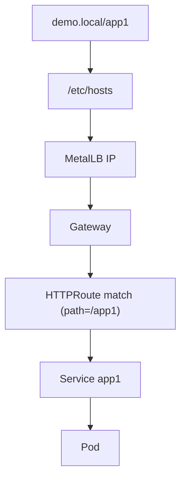

## 🚀 Kubernetes Gateway API Demo (Local Lab with MetalLB)
## Table of Contents

- [Overview](#overview)
- [Why Gateway API? (History & Motivation)](#why-gateway-api-history--motivation)
- [Architecture Diagram](#architecture-diagram)
- [Traffic Flow](#traffic-flow)
- [Prerequisites](#prerequisites)
- [Step 1: Install Gateway API](#step-1-install-gateway-api)
- [Step 2: Install MetalLB](#step-2-install-metallb)
- [Step 3: Configure IP Pool](#step-3-configure-ip-pool)
- [Step 4: Deploy Sample Apps](#step-4-deploy-sample-apps)
- [Step 5: Gateway Setup](#step-5-gateway-setup)
- [Step 6: HTTPRoute (Path + Host + Header)](#step-6-httproute-path--host--header)
- [Step 7: Configure /etc/hosts](#step-7-configure-etchosts)
- [Step 8: Testing](#step-8-testing)
- [Gateway API vs Ingress](#gateway-api-vs-ingress)
- [Comparison Example](#comparison-example)
- [Troubleshooting](#troubleshooting)
- [Key Takeaways](#key-takeaways)


## 🧭 Overview
This guide demonstrates how to **deploy and test Kubernetes Gateway API** in a **local VMware Fusion Pro lab** using:
+ 🖥️ VM-based Kubernetes cluster
+ 🌐 MetalLB (for LoadBalancer IPs)
+ 🧾 `/etc/hosts` (for local DNS resolution without public IP)
+ ⚡ Cilium Gateway API (built-in, no extra install needed)

Note:
+ _We opted for host file because for lab we normally do not have a public IP addres lying around, nor does we have a public DNS pointing to it._
+ _We can also use other virtualization tools other than VMware Fusion, eg Hyper-V, etc)_

It includes:
+ ✅ Path-based routing (`/app1`, `/app2`)
+ ✅ Hostname-based routing
+ ✅ Conditional header-based routing
+ ✅ Architecture diagrams
+ ✅ Gateway API vs Ingress comparison

## 📜 Why Gateway API? (History & Motivation)

The traditional **Ingress API** has been widely used but has limitations:

+ ⚠️ Controller-specific annotations (not portable)
+ ⚠️ Limited extensibility
+ ⚠️ Weak separation of concerns

✨ **Gateway API improves this by**:

+ 👥 Role-oriented design (infra vs app teams)
+ 🔌 Extensible routing model
+ 🎯 Rich traffic matching (path, host, headers)

👉 Gateway API is the **next evolution of Ingress**.
Instead of configuring everything inside an Ingress object, it separates the implementation of listeners (HTTP, TCP, etc) and the URL path itself. 

### 💡 Why Cilium Gateway API?
Unlike NGINX Gateway Fabric:
+ ❌ No CRD size issues
+ ❌ No extra installation required (already in cluster utilizing Cilium as CNI, just need enablement)
+ ✅ Works out-of-the-box with Cilium CNI
+ ✅ Uses Envoy (production-grade proxy)

👉 Conclusion: Best choice for local labs

## 🏗️ Architecture Diagram



## 🔀 Traffic Flow



## ⚙️ Prerequisites

+ Kubernetes cluster with Cilium installed
+ MetalLB installed
+ kubectl access
+ Helm (for enabling Cilium Gateway API)

## ⚠️ Step 0: Enable Cilium Gateway API (REQUIRED)

> If you are using Cilium as CNI, **Gateway API is NOT enabled by default**. However, if you follow my other article [Create local Kubernetes cluster](Create%20local%20Kubernetes%20cluster.md), there is an option to enable this during initial Cilium installation.

🔍 Check if already enabled

```
kubectl get gatewayclass
```
If you do NOT see:
`cilium   io.cilium/gateway-controller   True`

👉 Then you must enable it.

🚀 Uninstall current Cilium
```
helm uninstall cilium -n kube-system
```

🔄 Enable Cilium with Gateway API

```
helm install cilium cilium/cilium \
  --namespace kube-system \
  --create-namespace \
  --set kubeProxyReplacement=true \
  --set nodePort.enabled=true \
  --set operator.replicas=1 \
  --set gatewayAPI.enabled=true \
  --set gatewayAPI.deployController=true \
  --set standaloneDnsProxy.enabled=false \
  --wait
```

🔄 Restart Cilium Daemonset and Gateway API controller deployment

```
kubectl -n kube-system rollout restart ds cilium
kubectl -n kube-system rollout restart deployment cilium-operator
```

✅ Verify

```
kubectl get gatewayclass
```
Expected:
```
NAME     CONTROLLER                      ACCEPTED
cilium   io.cilium/gateway-controller    True
```

👉 Only proceed once this is working.


## 📦 Step 1: Install Gateway API

```
kubectl apply -f https://github.com/kubernetes-sigs/gateway-api/releases/download/v1.0.0/standard-install.yaml
```


## 📦 Step 2: Install MetalLB

```
kubectl apply -f https://raw.githubusercontent.com/metallb/metallb/v0.14.5/config/manifests/metallb-native.yaml
```


Note: If you have installed MetalLB before, the configured resources will simply remained "unchanged".


## 🌐 Step 3: Configure IP Pool

The IP range under _.spec.addresses_ must be reachable from the host. Normally this is the same IP address range used by the nodes. </br>
Use `kubectl get nodes -o wide` to confirm it. <br>
Use `ip address` to confirm the CIDR mask. </br>
Pick a small range inside that subnet which won't be used by nodes. For example if the CIDR is /24, pick range at the end, between .240 to .250.

```
apiVersion: metallb.io/v1beta1
kind: IPAddressPool
metadata:
  name: pool
  namespace: metallb-system
spec:
  addresses:
  - 172.16.121.240-172.16.121.250
---
apiVersion: metallb.io/v1beta1
kind: L2Advertisement
metadata:
  name: l2
  namespace: metallb-system
```


## 🧪 Step 4: Deploy Sample Apps

Create 2 NGINX deployments, `app1` and `app2`, each with their respective service. 

```
apiVersion: apps/v1
kind: Deployment
metadata:
  name: app1
spec:
  replicas: 1
  selector:
    matchLabels:
      app: app1
  template:
    metadata:
      labels:
        app: app1
    spec:
      containers:
      - name: nginx
        image: nginx
---
apiVersion: v1
kind: Service
metadata:
  name: app1
spec:
  selector:
    app: app1
  ports:
  - port: 80
---
apiVersion: apps/v1
kind: Deployment
metadata:
  name: app2
spec:
  replicas: 1
  selector:
    matchLabels:
      app: app2
  template:
    metadata:
      labels:
        app: app2
    spec:
      containers:
      - name: nginx
        image: nginx
---
apiVersion: v1
kind: Service
metadata:
  name: app2
spec:
  selector:
    app: app2
  ports:
  - port: 80
```


## 🚪 Step 5: Gateway Setup

```
apiVersion: gateway.networking.k8s.io/v1
kind: Gateway
metadata:
  name: demo-gateway
spec:
  gatewayClassName: cilium
  listeners:
  - name: http
    protocol: HTTP
    port: 80
```
Unlike Ingress, only the protocols are configured in Gateway resource. The path configurations are implemented in HTTPRoute resource. 

### 🔍 Step 5.1: Verify Gateway 

```
kubectl describe gateway demo-gateway
```

We should see:

```
Status: True
Addresses:
  Type: IPAddress
  Value: 172.16.121.240  # This is IP address assigned to MetalLB.
```


If you see:

`Waiting for controller`


👉 Your controller is not installed or not matching `controllerName`. Recheck that Cilium Gateway API controller is installed. Refer Step 0).

### 🔍 Step 5.2: Verify LoadBalancer

```
kubectl get svc -A | grep LoadBalancer
```
👉 You should now see a Cilium-managed service with MetalLB IP


## 🧭 Step 6: HTTPRoute (Path + Host + Header)

```
apiVersion: gateway.networking.k8s.io/v1
kind: HTTPRoute
metadata:
  name: demo-route
spec:
  parentRefs:
  - name: demo-gateway
  hostnames:
  - demo.local
  rules:

  # Path-based routing
  - matches:
    - path:
        type: PathPrefix
        value: /app1
    filters:
    - type: URLRewrite
      urlRewrite:
        path:
          type: ReplacePrefixMatch
          replacePrefixMatch: /
    backendRefs:
    - name: app1
      port: 80

  - matches:
    - path:
        type: PathPrefix
        value: /app2
    filters:
    - type: URLRewrite
      urlRewrite:
        path:
          type: ReplacePrefixMatch
          replacePrefixMatch: /
    backendRefs:
    - name: app2
      port: 80

  # Header-based routing
  - matches:
    - headers:
      - name: x-env
        value: test
    filters:
    - type: URLRewrite
      urlRewrite:
        path:
          type: ReplacePrefixMatch
          replacePrefixMatch: /
    backendRefs:
    - name: app2
      port: 80
```
+ _.spec.parentRefs_ refers to the Gateway object name we defined earllier.
+ _.spec.hostnames_ refers to the hostname we want to use, which must be configured in `/etc/hosts`.
+ We included 2 sections in the YAML, one for path-based routing, the other for header-based routing.
+ For each condition we want to match, we created _.spec.matches[]_ array item.
+ _.spec.matches[*].backendRefs_ refers to the service that will handled the traffic.


## 🧾 Step 7: Configure /etc/hosts

To bypass DNS from the host, we edit the `/etc/hosts` file and included the first IP address for the range picked in Step 3. </br>
Resolve the chosen hostname to this IP address.

```
sudo vim /etc/hosts
```


⚠️ To curl succesfully from the host using `/etc/hosts` bypassing DNS, the networking mode of VMware Fusion Pro has to be in "bridged" mode. If it is configured as "NAT" mode, then it won't work (Refer step 8 below for mitigation). 
This is due to in NAT mode, the Metal LB loadbalancer IP address is not reachable from the host. 


You can re-configure VMware Fusion to use bridge mode, but then this will reset all the node IP addresses, which will mess up the Kuberentes cluster. 
Alternatively, we can use NodePort to mitigate this.

## 🧪 Step 8: Testing (Important Networking Notes)

⚠️ VMware NAT Limitation
If your Kubernetes nodes are running on **VMware Fusion (NAT / Host-only network)**:
> ❌ MetalLB external IP (e.g. 172.16.121.240) may NOT be reachable from your host
This is because MetalLB uses **Layer 2 (ARP)**, which is not properly supported in NAT mode.

### 🔹 Path-based
```
curl -H "Host: demo.local" http://172.16.121.240/app1
curl -H "Host: demo.local" http://172.16.121.240/app2
```

### 🔹 Header-based routing
```
curl -H "x-env: test" http://demo.local
```

### 🔹 Browser
+ http://demo.local/app1
+ http://demo.local/app2

## ✅ Step 8.1: Test from inside the cluster (Baseline)

Run from your master node:

```
curl -H "Host: demo.local" http://172.16.121.240/app1
```

Expected:

```
Welcome to nginx!
```

If you get **404 Not Found**, ensure you have configured **URLRewrite filter** in HTTPRoute.

## ⚠️ Step 8.2: Why direct curl from host may fail

```
curl http://demo.local/app1
```

Even if `/etc/hosts` is correct, this may fail because:
+ MetalLB IP is not reachable from host (NAT limitation)
+ ARP resolution does not work across VM boundary

+ 


## ✅ Step 8.3: Use NodePort (Recommended for Lab)

Get NodePort:

```
kubectl get svc cilium-gateway-demo-gateway
```

Example output:

```
80:32219/TCP
```

Test from Mac:

```
curl -H "Host: demo.local" http://<NODE-IP>:32219/app1
```

Example:

```
curl -H "Host: demo.local" http://172.16.121.208:32219/app1
```


## ✅ Step 8.4: Alternative - Port Forward

```
kubectl port-forward svc/cilium-gateway-demo-gateway 8080:80
```

Then:

```
curl -H "Host: demo.local" http://localhost:8080/app1
```

## 🧠 Step 8.5: Hostname Matching Requirement

Since HTTPRoute uses:

```
hostnames:
- demo.local
```

You MUST include Host header:

```
curl -H "Host: demo.local" http://<IP>/app1
```

Otherwise, route will NOT match.

## 🧠 Step 8.6: Path Rewrite Requirement

If using subpaths (`/app1`, `/app2`), backend apps like NGINX expect `/`. </br>

Ensure HTTPRoute includes:

```
filters:
- type: URLRewrite
  urlRewrite:
    path:
      type: ReplacePrefixMatch
      replacePrefixMatch: /
```

## 🧪 Step 8.7: Final Working Test Matrix

| Scenario        | Command      | Expected   |
|-----------------|-----------------|----------------|
| Inside node     | `curl -H "Host: demo.local" http://172.16.121.240/app1` | ✅ Works |
| Host via LB IP | `curl http://demo.local/app1`               | ❌ May fail (NAT)              |
| Host via NodePort| `curl -H "Host: demo.local" http://<NODE-IP>:NODEPORT/app1`               | ✅ Works              |
| Port-forward   | `curl -H "Host: demo.local" http://localhost:8080/app1`               | ✅ Works              |


## ⚖️ Gateway API vs Ingress

| Feature         | Ingress         | Gateway API    |
|-----------------|-----------------|----------------|
| Model           | Single-resource | Multi-resource |
| Role separation | ❌               | ✅              |
| Path routing    | ✅               | ✅              |
| Host routing    | ✅               | ✅              |
| Header matching | ❌               | ✅              |
| Extensibility   | Low             | High           |
| Portability     | Low             | High           |

## 🔍 Comparison Example

### Ingress
```
- host: demo.local
  http:
    paths:
    - path: /app1
```

### Gateway API
```
hostnames:
- demo.local
matches:
- path:
    value: /app1
```

## 🛠️ Troubleshooting

+ ❌ No External IP → Check MetalLB
+ ❌ Route fail → `kubectl describe httproute`
+ ❌ Gateway not ready → `kubectl describe gateway`

## 🎯 Key Takeaways

+ Gateway API is the future of Kubernetes traffic management
+ Cilium Gateway API is simpler for labs
+ MetalLB enables realistic local testing.
+ VMware NAT may block external access to LoadBalancer IP.
+ `/etc/hosts` simulates DNS
+ Subpath routing often requires URL rewrite
+ Supports path + host + header routing

Gateway API is extensively more configurable than Ingress. We can do advance stuffs like HTTPS, filters rewriting, traffic splitting and mult-gateway architecture. 
Time-permitting, I will include those in later articles.
