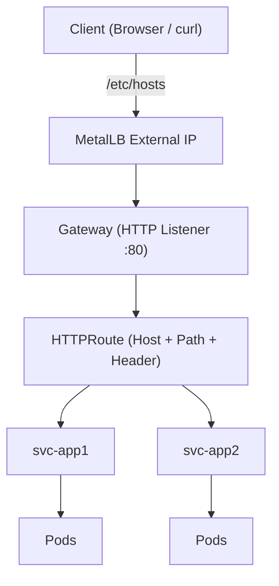
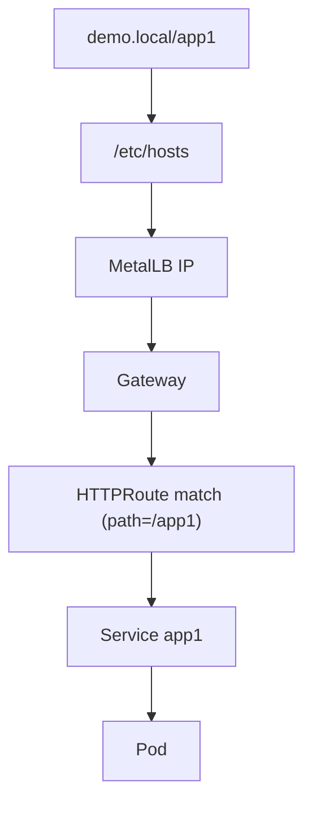

## 🚀 Kubernetes Gateway API Demo (Local Lab with MetalLB)
## Table of Contents

- [Overview](#overview)
- [Why Gateway API? (History & Motivation)](#why-gateway-api?-(history-&-motivation))
- [Architecture Diagram](#architecture-diagram)
- [Traffic Flow](#traffic-flow)
- [Step 3: Install the Chart](#step-3-install-the-chart)
- [Step 4: View the pods and services](#step-4-view-the-pods-and-services)
- [Step 5: Access the web app](#step-5-access-the-web-app)
- [Conclusion](#conclusion)
- [Extra: YAML files](#extra-yaml-files)

## 🧭 Overview
This guide demonstrates how to **deploy and test Kubernetes Gateway API** in a **local VMware Fusion Pro lab** using:
+ 🖥️ VM-based Kubernetes cluster
+ 🌐 MetalLB (for LoadBalancer IPs)
+ 🧾 `/etc/hosts` (for local DNS resolution without public IP)

* _Note we opted for host file because for lab we normally do not have a public IP addres lying around, nor does we have a public DNS pointing to it._

It includes:
+ ✅ Path-based routing (`/app1`, `/app2`)
+ ✅ Hostname-based routing
+ ✅ Conditional header-based routing
+ ✅ Architecture diagrams
+ ✅ Gateway API vs Ingress comparison

## 📜 Why Gateway API? (History & Motivation)

The traditional **Ingress API** has been widely used but has limitations:

+ ⚠️ Controller-specific annotations (not portable)
+ ⚠️ Limited extensibility
+ ⚠️ Weak separation of concerns

✨ **Gateway API improves this by**:

+ 👥 Role-oriented design (infra vs app teams)
+ 🔌 Extensible routing model
+ 🎯 Rich traffic matching (path, host, headers)

👉 Gateway API is the **next evolution of Ingress**.

## 🏗️ Architecture Diagram



## 🔀 Traffic Flow



## Step 3: Install the Chart
> Ensure you are in the same directory where _Chart.yaml_ is.

+ ⚓ Install the Helm chart (we give it the name "myapp"):

  ```
  helm install myapp .
  ```

  The command will display the status of the Helm chart.
  
  

+ Verify the Helm chart is successfully running:

  ```
  helm list
  ```

  


## Step 4: View the pods and services

  🚀 View all the Kubernetes resources that are associated with the web app deployment:

  ```
  kubectl get pods -l 'app in (mongo,node-web)'
  kubectl get svc
  kubectl get deploy node-web
  kubectl get deploy mongo
  ```

  

## Step 5: Access the web app

Once eveything is in placed, you can query the localhost destination via the NodePort exposed port, 30080.

Either query using <code style="color : red">_curl_</code>, or access via web browser URL. 

🚀 It should return successful result. 

Using <code style="color : red">_curl_</code>:

  
  

Using web browser:

  


## Conclusion

This section describe on high-level of the above web app deployment setup. 

In brief, we deployed 2 services and 2 deployments, each serving different section of the traffic flow. 

The front-end consists of **node-web service** and **node-web deployment**. 
The **node-web service** accepts incoming traffic via its exposed NodePort port, 30080 (or 30001) and distribute it to the pod of **node-web deployment**. We only have a sinle replica in this setup, but we can easily scale up the deployment.

The back-end consists of **mongo service** and **mongo deployment**. After being processed by the front-end, the node-web pod sends the traffic to **mongo service** using the URL defined in its container environment, and the **mongo service** distribute the traffic to pods of **mongo deployment**. Again, we only have a single replica for education purposes. 

Diagram below visualize the flow.


## Extra: YAML files

All the YAML and source code files used in this tutorial are available at [ZIP](files/node-mongo-demo-helm.zip).
